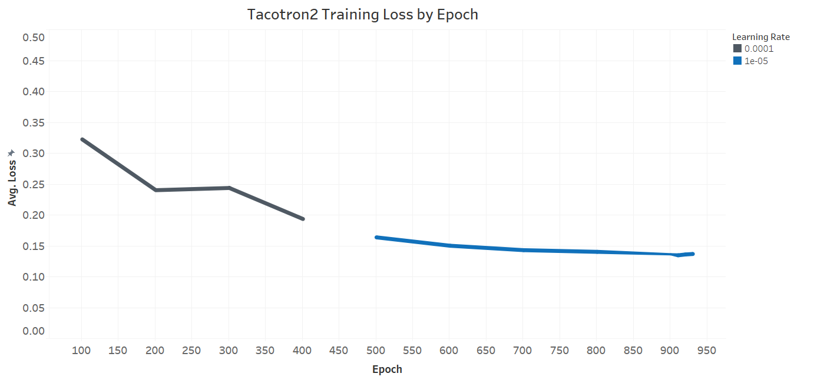
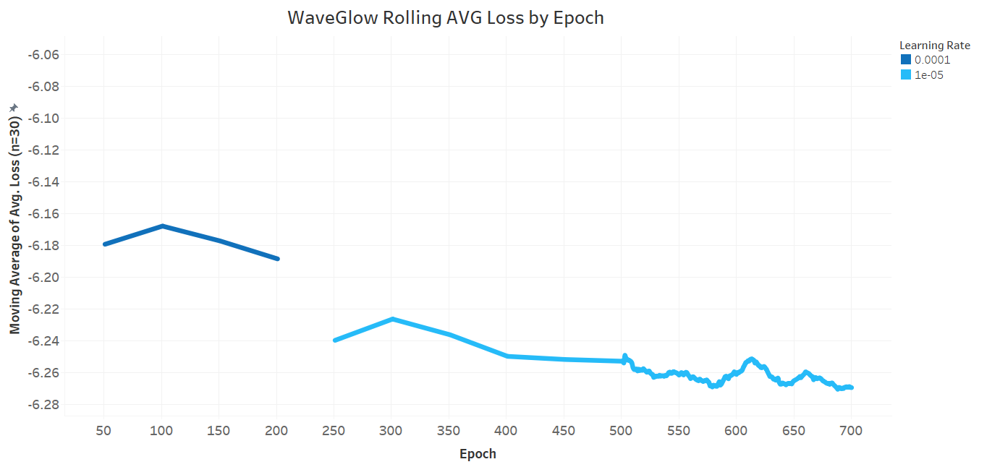
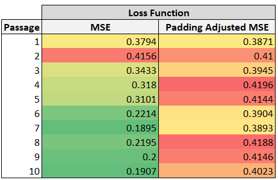

# Tacotron 2 And WaveGlow For PyTorch

This repository provides additions to NVIDIA/DeepLearningExamples scripts to further optimize training and inferences with Tacotron 2 and WaveGlow v1.6 models. More fundamentally, this repository is designed to provide a recipe for not just how to train a text-to-speech (TTS) model using an existing open source dataset (i.e. LJ voice), but to be able to easily scale application to new voices through tools for script management, audio editing, transfer learning, and more. As such, the repo comes equipped with a new open source voice dataset (AC voice) and associated models/inferences as a proof of concept.

## Source Repo

[Source README.md](https://github.com/acharabin/DeepLearningExamples/blob/master/PyTorch/SpeechSynthesis/Tacotron2/README_original.md)

DeepLearningExamples/.../Tacotron2 is the latest Pytorch implementation of Tacotron2 managed by NVIDIA and has several benefits over NVIDIA's independant Tacotron2 and WaveGlow repositories. 
- Common code for Tacotron2 and WaveGlow is consolidated
   * This reduces administration time for updates to common code and allows additional functionality (i.e. warm start) to be made available to both models simultaneously. 
- Command line arguments
   * In contrast to [NVIDIA/Tacotron2](https://github.com/NVIDIA/tacotron2) which uses a separate configuration file for model parameters, this repo offers the flexibility to change hyperparameters and other configurations by passing arguments when running a module. 
   * Recommended hyperparameters are set as default if no respective argument is passed.
- Switching costs are avoided
   * Both the TTS feature predictor (Tacotron2) and neural vocoder (WaveGlow) can be trained in the same repo eliminating time resulting from file transfer and otherwise switching across repos. 
   * An inference module is provided that manages the hand-off between the Tacotron2 and WaveGlow models to get inferences with your trained model quickly.

For those new to TTS and Tacotron2/WaveGlow, it's recommended to read the initial context provided in the source repo. 

## Additions to Source Repo

- [Padding adjusted loss](#padding-adjusted-loss)
- [Analytics tracking](#analytics-tracking)
- [Warm start](#warm-start)
- [Inference using ground truth mels](#inferece-using-ground-truth-mels)
- [Data Acquisition](#data-aquisition)
   * [Script management](#script-management)
   * [Audio editing](#audio-editing)
- [Training WaveGlow with predicted mels](#predicted-mels)

## Table of Contents

- [Example model inference](#example-model-inference)
- [Getting Started](#getting-started)
   * [Requirements](#requirements)
   * [Initial setup](#initial-setup)
   * [Voice recording](#voice-recording)
   * [Training hyperparameters](#training-hyperparameters)
      * [Batch size](#batch-size)
      * [Learning rate annealing](#learning-rate-annealing)
   * [Training commands](#training-commands)
   * [Inference command](#inference-command)
- [Performance](#performance)
   * [Example learning curve](#example-learning-curve)
- [Additions to source repo](#additions-to-source-repo)
- [Release notes](#release-notes)
   * [Changelog](#changelog)
   * [Known issues](#known-issues)

## Example model inference

[seashells_AC.wav](https://github.com/acharabin/DeepLearningExamples/tree/temp/PyTorch/SpeechSynthesis/Tacotron2/audio/seashells_AC.wav)

## Getting Started
### Requirements

The following section lists the requirements in order to start training the
Tacotron 2 and WaveGlow models.

This repository contains Dockerfile which extends the PyTorch NGC container
and encapsulates some dependencies. Aside from these dependencies, ensure you
have the following components:

- [NVIDIA Docker](https://github.com/NVIDIA/nvidia-docker)
- [PyTorch 20.06-py3 NGC container](https://ngc.nvidia.com/registry/nvidia-pytorch)
or newer
- Supported GPUs:
   - [NVIDIA Volta](https://www.nvidia.com/en-us/data-center/volta-gpu-architecture/)
   - [NVIDIA Turing](https://www.nvidia.com/en-us/geforce/turing/)
   - [NVIDIA Ampere architecture](https://www.nvidia.com/en-us/data-center/nvidia-ampere-gpu-architecture/)

For more information about how to get started with NGC containers, see the
following sections from the NVIDIA GPU Cloud Documentation and the Deep Learning
Documentation:

### Initial setup

Complete the following steps to get ready for model training with a voice dataset. 

1. Clone the repository.
   ```bash
   git clone https://github.com/acharabin/DeepLearningExamples.git
   cd DeepLearningExamples/PyTorch/SpeechSynthesis/Tacotron2
   ```

2. Build the Tacotron 2 and WaveGlow PyTorch NGC container.
   ```bash
   bash scripts/docker/build.sh
   ```

3. Start an interactive session in the NGC container to run training/inference.
After you build the container image, you can start an interactive CLI session with:

   ```bash
   bash scripts/docker/interactive.sh
   ```
   
   The container is run in the background so it doesn't terminate if local connection is lost. It can be attached to the console with:

   ```bash
   docker attach test_tacotron2
   ```
   
   It can be detached by click CTRL + p then CTRL + q.

   After detaching, it can be stopped with:
   
   ```bash
   docker stop test_tacotron2
   ```

4. (Optional) Set s3 bucket credentials.
   
   If your compute instance is associated with an AWS account, it's recommended to connect your s3 bucket to reduce file transfer admin. 

   Run vim .env to open a .env file in linux, press i, and paste the following after filling in the entries:

   ```bash
   vim .env
   [s3]
   bucket = <s3 bucket>
   prefix = <folder>
   aws_access_key_id = <aws_access_key_id>
   aws_secret_access_key = <aws_secret_access_key>
   ```
   
   press ESC then type :wq then Enter to save the file. 

5. (Optional) Download existing models.

   Existing models can be downloaded [here](https://drive.google.com/drive/folders/1oj0NU7eQ_KpI3WPvJOFNYpz7gOi9ui6l) to use for warm start or inference testing.

   s3 can be used as an intermediary between a local computer and cloud compute instance.

   Example s3 download
   ```bash
   import boto3
   s3 = boto3.client('s3',aws_access_key_id=<aws_access_key_id>,aws_secret_access_key=<aws_secret_access_key>)
   file_name='waveglow_1076430_14000_amp.pt'
   s3.upload_file(f"""<path>/{file_name}""",'<s3 bucket>',f"""<prefix>/{file_name}""")
   ```

   Example s3 upload
   ```bash
   import boto3
   s3 = boto3.client('s3',aws_access_key_id=<aws_access_key_id>,aws_secret_access_key=<aws_secret_access_key>)
   file_name='waveglow_1076430_14000_amp.pt'
   s3.download_file(<s3 bucket>, f"""<prefix>/{file_name}""", f"""<path>/{file_name}""")secret
   ```

### Voice recording

AC-Voice-Cloning-Data is available in the repo for use in model training. The first 10% of passages (1250) in the LJ Speech Dataset were used. To record and use a new voice using the same script, record each passage in the AC-Voice-Cloning-Data/filelists/acs_audio_text_<train or validation>_filelists.txt scripts and organize outputs chronologically in a folder. Then, complete the steps noted in the [Data Acquisition section](#data-aquisition). The end result is ~ 2.4 hours of recorded audio which takes ~ 10 hours of recording time. Mels can be generated in advance by running the scripts/prepare_mels_ac.sh file after ensuring the script references the new audio folder. 

### Training hyperparameters

Hyperparameters recommended in the official Tacotron2 and WaveGlow papers were used as a starting point with some caveats noted below.  

#### Batch size

When using distributed training, one batch is allocated to each GPU and each update step includes the batches allocated to each GPU. The true batch size is thus the selected batch size mutliplied by the number of GPUs.

The official Tacotron2 and WaveGlow papers referenced using a batch size of 64 and 24, respectively. Using distributed training with 8 GPUs, the equivalent batch size arguments are 8 and 3, respectively.

#### Learning rate annealing

For Tacotron2, a reduction in the learning rate by 50% every 500 epochs is imposed.

For WaveGlow, a reduction in the learning rate by 10% is made at epoch 200 (when loss plateaus) to allow for fine tuning. This was inspired by the WaveGlow official paper - 'When training appeared to plateau, the learning rate was further reduced to 5 × 10−5.'

Note that these recommendations assume warm starting using an existing model (i.e. NVIDIA/LJ Voice).    

### Training commands

The train.py script is used to train Tacotron2 and WaveGlow models. It reference model-specific modules in the tacotron2/ and waveglow/ directories. To see all available command line arguments in the train.py script, run the following:

```bash
python train.py -h
```

#### 8 X NVIDIA V100 GPUs / AWS p3dn.24xlarge instance

NVIDIA/LJ Voice models are used for warm start.

Tacotron2
```bash
python -m multiproc train.py -o output/ -m Tacotron2 --epochs 1001 --epochs-per-checkpoint 100 -bs 8 -lr 1e-3 --cudnn-enabled --load-mel-from-disk --log-file tacotron2log.json --training-files AC-Voice-Cloning-Data/filelists/mel/acs_mel_text_train_filelist.txt --validation-files AC-Voice-Cloning-Data/filelists/mel/acs_mel_text_validation_filelist.txt --anneal-steps 500 1000 --anneal-factor 0.5 --amp --upload-epoch-loss-to-s3 --warm-start --checkpoint-path output/tacotron2_1032590_6000_amp.pt --loss-function padding-adjusted-mse --epoch-loss-samples 1249
```

WaveGlow
```bash
python -m multiproc train.py -m WaveGlow -o output/ -lr 1e-4 --epochs 751 --epochs-per-checkpoint 50 -bs 3 --segment-length 8000 --weight-decay 0 --grad-clip-thresh 65504.0 --cudnn-enabled --cudnn-benchmark --log-file waveglowlog.json --training-files AC-Voice-Cloning-Data/filelists/audio/acs_audio_text_train_filelist.txt --validation-files AC-Voice-Cloning-Data/filelists/audio/acs_audio_text_validation_filelist.txt --anneal-steps 200 --anneal-factor 0.1 --amp --upload-epoch-loss-to-s3 --warm-start --ignore-layers [] --checkpoint-path output/waveglow_1076430_14000_amp.pt --wn-channels 256 --epoch-loss-samples 1249
```

To continue training from the last saved checkpoint, remove the --warm-start and --checkpoint-path arguments and add the --resume-from-last argument. 

--uploadepoch-loss-to-s3 argument should be removed if s3 credentials weren't added in the .env file. 

--remove-module-from-state-dict argument should be added when training on a single GPU if the model used for warm start was trained on multiple GPUs. 

### Inference command

The following command can be used to get an inference with a Tacotron2 and WaveGlow checkpoint. 

```bash
python inference.py --tacotron2 <Tacotron2_checkpoint> --waveglow <WaveGlow_checkpoint> --wn-channels 256 -o output/ --include-warmup -i phrases/phrase.txt --upload-to-s3 --suffix _letters --fp16
```

--upload-to-s3 should be removed if s3 credentials weren't added in the .env file.

## Performance

The following results were obtained using 8 X NVIDIA V100 GPUs (AWS p3dn.24xlarge instance) and ~ the training commands above. Tacotron2 training took 0.00698 hrs/epoch and WaveGlow training took 0.00488 hrs/epoch, derived from the date stamps outputted in the epochresults{modelname}.csv file. 

Entire training set epoch loss was computed after the fact using saved checkpoints vs. saving during training which is now supported by the repo. As a result, a smooth/complete learning curve is lost. However, the data is still presented below as it can serve as a useful training benchmark.
  
### Example learning curve

#### Tacotron2


#### WaveGlow


## Additions to source repo

### Padding adjusted loss

A requirement of Tacotron2 & WaveGlow training is for all passages in a batch to have a consistent size. To accomplish this, WaveGlow uses a stochastic approach whereby an audio segment of a fixed segment length is randomly sampled from each passage, afterwhich it's mel spectrogram pair is derived. Since the fixed segment length must be less than or equal to the passage audio length for the passage to be included, 'padding' isn't required. Given WaveGlow isn't autoregressive - only features at the current time step are used to predict respective audio - this makes adjusting segment length akin to adjusting batch size. Tacotron2 on the other hand is autoregressive; the full chronology of time steps in a passage is needed for good performance. As a result, instead of a stochastic segment sampling, Tacotron2's data loader uses a custom collate (passage combination) function that adjusts all passages in a batch to have the same length as that of its longest passage. This is performed separately for both passage input characters and mel spectrograms, the inputs and outputs of the Tacotron2 model. Length is added to passages using zero padding, which fills character embedding vectors and/or audio at a time step, with values of 0.

Tacotron2 uses mean squared error (MSE) loss out of box whereby the squared error is computed between actual and predicted mel spectrogram decibals at each frequency bin and time step, then averaged. The values for some of these time steps (for passages that aren't the longest) will all be zero because of the zero padding. As the batch size increases, the longest passage length in the batch is expected to increase, and as a result more time steps become zero padded. Predictions of 0 across all time steps will perform well for the shortest passages that contain almost all zero-padded time steps, so loss decreases. This makes loss incomparable across different batch sizes and different passages in a batch. As an illustration of the incomparable loss across different passages, find the difference in MSE loss for the first 10 passages in the LJ voice dataset ordered by passage text length descending, and using a batch size of 10 with NVIDIA's pretrained models. 

<p align="center">
  
</p>

Most critically, including padding in the loss function encourages the Tacotron2 model to focus on learning when the passage has stopped vs. the mel features of the passage. This makes training Tacotron2 highly inefficient and prevents convergence when using large batch sizes. At small batch sizes, the signal at each update step is diluted by the padding.

Fortunately, padding can be 'excluded' from loss computation with minimal intervention to vanilla MSE loss. Instead of taking the mean squared loss, a sum of squared loss is taken across all frequency bins and time steps, and divided by the number of frequency bins in time steps that aren't zero padded (don't contain all zeros). The numerator is still burdened by padded time steps to encourage accurate stopping prediction, but now the denominator reflects the true passage length. The end result is an improved loss calculation that makes loss comparable across different passages and batch sizes, and more importantly provides drastic improvements in the productivity of each learning step when medium to large batch sizes are used. Ammendments can be found in the following file: [tacotron2/loss_function.py](https://github.com/acharabin/DeepLearningExamples/blob/master/PyTorch/SpeechSynthesis/Tacotron2/tacotron2/loss_function.py)

### Analytics tracking

Having an accurate, ongoing, and easily accessible log of model training loss as Tacotron2 and WaveGlow models train is essential to properly supervise model training and ensure efficient use of GPUs. If training loss has converged, hits a spike, or isn't meeting expectations/requirements, the training overseer needs to take action by adjusting hyperparameters, changing the model setup, or halting training. 

The source repo provides logging of the training loss at each batch prior to update steps as well as loss at the end of each epoch. While the repo states that 'training loss is averaged over an entire training epoch', it is clear upon further investigation that the epoch loss provided references the last batch's loss. While validation loss across all validation samples is logged at the end of each epoch, NVIDIA Tacotron2 repositories and the official paper only reference training loss as the benchmark for model convergence. As the batch size decreases, batch training loss deviates farther from complete training loss. The training overseer can no longer reliably monitor how the well model fits the data over time. The problem is exacerbated in WaveGlow where an additional stochastic element is added to the batching process; for each epoch/passage, a sample of frames of a fixed 'segment length' (typically between 4K and 16K) are taken from each passage and used training. Note that with a sampling rate of 22050 audio frames per segment, a segment length of 4K would result in passage segments that are less than 1/5th of a second. While this added stochastic element defends against overfitting and supports model generalization, it further degrades the usefulness of batch training loss to guage model learning. 

The resolution implemented was adding an additional step after all batches in an epoch are completed to compute the training loss across a random sample of (or all) training passages based on the --epoch-loss-samples argument. A separate batch size is used with a default value of 49, which can be adjusted using the --elbs command. Furthermore, results are appended to a file epochtrainingloss{modelname}.csv in the selected output directory at the end of each epoch. If --upload-to-s3 argument is used, the compute instance is associated with an AWS account, and associated s3 bucket and key information is provided in the Tacotron2/.env file, epoch loss will automatically be uploaded to s3 after each epoch so it can be connected to analytics tools for learning curve visualization (i.e. Tableau, Jupyter Notebook). Ammendments can be found in the following file: [tacotron2/train.py](https://github.com/acharabin/DeepLearningExamples/blob/master/PyTorch/SpeechSynthesis/Tacotron2/train.py)

### Warm start

Warm start code from [NVIDIA/Tacotron2](https://github.com/NVIDIA/tacotron2) integrated but now using command line arguments to choose a model to warm start from and decide which layers to ignore. Warm start is also available for WaveGlow training. NVIDIA's [LJ voice WaveGlow checkpoint](https://catalog.ngc.nvidia.com/orgs/nvidia/models/waveglow256pyt_fp16/files) provides recognizable inferences of new Voices without additional training, and can be used with warm start to achieve high quality audio substantially quicker than training from scratch.       

### Inference using ground truth mels

To guage whether Tacotron2 or WaveGlow is the bottleneck for improved inference quality, WaveGlow checkpoints can be run using ground truth mels for a selected passage. The difference between inferences obtained using ground truth mels and those obtained using Tacotron2 infered mels tells you the inference quality improvement that would be achieved if Tacotron2 was trained to perfectly match the actual audio. Furthermore, the difference between the inferences obtained using the ground truth mels and the ground truth audio tells you the inference quality improvement that would be achieved if the neural vocoder (in this case WaveGlow) was trained to perfectly match the actual audio. Whichever model is farther away from it's 'ideal' model based on an opinion score should be the focus for additional tuning efforts.  

See below for an example inference command using ground truth mels. 

```bash
python inference.py --tacotron2 <Tacotron2_checkpoint> --waveglow <WaveGlow_checkpoint> --wn-channels 256 -o output/inference/groundtruth/ --include-warmup -i AC-Voice-Cloning-Data/filelists/audio/acs_audio_text_train_filelist.txt --suffix _train1 --use-ground-truth-mels --cpu --gtm-index 0 --fp16
```

In this case, the --gtm-index argument indicates to use the first passage in the filelist provided (-i) to get inferences. Ground truth audio is then obtained from the path in the filelist. 

### Data Acquisition
#### Script management

Once recorded .wav files are obtained and organized chronologically, functions in the [notebooks/scriptmanagement.pynb](https://github.com/acharabin/DeepLearningExamples/blob/master/PyTorch/SpeechSynthesis/Tacotron2/notebooks/scriptmanagement.py) notebook can be used to create your dedicated voice folder, and name and move files to the right directory. After the first run of recordings, retakes may be nessary for some passages. Functions are available to automate retake administration, specifically, the creation of a retakes filelist and swapping of official audio files with new takes.  

#### Audio editing

Once the dedicated voice folder has been prepared containing the unedited voice files and other contents as indicated in the [script management section](#script-management), silence before and after spoken passages needs to be removed, and audio volume needs to be normalized to a fixed average. Automated functions to perform these adjustments can be found here: [tacotron2/audioediting.py](https://github.com/acharabin/DeepLearningExamples/blob/master/PyTorch/SpeechSynthesis/Tacotron2/tacotron2/notebooks/audioediting.pynb)

After completion of audio editing, the voice folder can be zipped and transferred to the Tacotron2/ directory in the compute instance to be used for training. Prior to training, mel spectrograms can be computed for each audio file to save time when training; refer to the [Voice Recording section](#voice-recording) for further details.  

### Training WaveGlow with predicted mels

In the original [Tacotron2 paper](https://arxiv.org/abs/1712.05884), the best performance was achieved when WaveNet was trained on Tacotron2 predicted mels vs. ground truth mels. The official [WaveGlow paper](https://arxiv.org/pdf/1811.00002v1.pdf) specifies application using ground truth mels. Existing NVIDIA WaveGlow repositories don't offer tools to train WaveGlow using predicted mels. It's expected that the inference quality of Tacotron2/WaveGlow models may be improved by training WaveGlow on Tacotron2 predicted mels, although there are technical limitations in doing so. Firstly, given WaveGlow isn't autoregressive and only uses information at the current time step to predict respective audio, properly reconciling the time steps of predicted mels and ground truth audio is essential. Secondly, the stochastic audio segment sampling used in WaveGlow further complicates properly mapping predicted mels with ground truth audio by time step. Thirdly, predicted mels and actual audio can have a different length, so clipping or padding would be required for WaveGlow to be trained on the last segment of a passage. Finally, since predicted mel spectrograms are 'reduced' - by preset the mels are an average over a window of 1024 frames of audio and hop by 256 frames per time step - there are additional challenges to align reduced mels with frames of audio. 

As an initial attempt inspired by the improvements noted in the Tacotron2 paper, functionality to save and use predicted mels in training was developed but remains in an experimental stage. The bottleneck for inference quality of the AC voice checkpoints provided was determined to be WaveGlow's ability to predict actual audio using ground truth mels (see [Inference using ground truth mels](#inference-using-ground-truth-mels)), and hence additional work using predicted mels was paused. 

The approach developed to save predicted mel/audition segments for a given passage is as follows: 

1. Obtain Tacotron2 predicted mels from the passage text.
2. Take the first segment of the mel and associated audio based on the segment length and save them to the output directories.
3. Create and append to a new filelist with the passage's text and link to the audio segment.
4. Repeat steps 2 & 3 with subsequent mel/audio segments until there are no additional audio segments for the passage.
5. For the last audio segment, add zero padding to complete the full segment if needed.   
6. Continue to the next passage.

The execution can be found in the below files:

[get_predicted_mels.py](https://github.com/acharabin/DeepLearningExamples/blob/master/PyTorch/SpeechSynthesis/Tacotron2/save_predicted_mels.py)

[waveglow/loss_function.py](https://github.com/acharabin/DeepLearningExamples/blob/master/PyTorch/SpeechSynthesis/Tacotron2/waveglow/data_function.py)

The following commands can be used to save predicted mel/audio segments and train WaveGlow using them. 

Save predicted mel/audio segments for train/validation
```bash
python save_predicted_mels.py -i AC-Voice-Cloning-Data/filelists/audio/acs_audio_text_train_filelist.txt -t --tacotron2 <Tacotron2_checkpoint> --split-segments --segment-length 32768 --no-padding --reset-filelist --empty-output-path

python save_predicted_mels.py -i AC-Voice-Cloning-Data/filelists/audio/acs_audio_text_validation_filelist.txt --filelist-output-path AC-Voice-Cloning-Data/filelists/audio/acs_audio_segment_text_validation_filelist.txt -v --tacotron2 <Tacotron2_checkpoint> --split-segments --segment-length 32768 --no-padding --reset-filelist --empty-output-path
```

Train WaveGlow with predicted mel/audio segments
```bash
python -m multiproc train.py -m WaveGlow -o output/ -lr 1e-4 --epochs 1001 --epochs-per-checkpoint 50 -bs 3 --segment-length 32768 --weight-decay 0 --grad-clip-thresh 65504.0 --cudnn-enabled --cudnn-benchmark --log-file waveglowlog.json --training-files AC-Voice-Cloning-Data/filelists/audio/acs_audio_text_train_filelist.txt --validation-files AC-Voice-Cloning-Data/filelists/audio/acs_audio_segment_text_validation_filelist.txt --amp --upload-epoch-loss-to-s3 --warm-start --ignore-layers [] --checkpoint-path <WaveGlow_checkpoint> --wn-channels 256 --use-predicted-mels
```

## Release notes

### Changelog

January, 2023
   * Initial release

### Known issues

There are no known issues in this release.
